# springboot033-基于SpringBoot的小徐影城管理系统

>  博主介绍：
>  Hey，我是程序员Chaers，一个专注于计算机领域的程序员
>  十年大厂程序员全栈开发‍ 日常分享项目经验 解决技术难题与技术推荐 承接各类网站设计，小程序开发，毕设等。
>  【计算机专业课程设计，毕业设计项目，Java，微信小程序，安卓APP都可以做，不仅仅是计算机专业，其它专业都可以】

## 本项目获取地址：https://www.bishecode.com/product/31/

## 3000套系统可挑选，获取链接：https://www.bishecode.com/

### 系统架构

> 前端：html | js | css | jquery | vue
>
> 后端：springboot | mybatis
> 
> 环境：jdk1.8+ | mysql | maven

# 一、内容包括
包括有  项目源码+项目论文+数据库源码+答辩ppt+远程调试成功

# 二、运行环境

> jdk版本：1.8 及以上； ide工具：IDEA； 数据库: mysql5.7及以上；编程语言: Java

# 三、需求分析

**3.1 可行性分析**

可行性分析主要是针对这个项目开发是否有意义和价值观来进行的全面分析，在分析的过程当中发现这个系统所存在的不足之处。就拿这次小徐影城管理系统的设计与实现来说主要是针对一些用户在发布小徐影城管理系统信息时遇到不方便的操作和问题来进行解决问题的，最后能够让小徐影城管理系统开发得到最大的用处。而且对于用户方面我们可以提供给一个简单方便操作的小徐影城管理系统。所以我们要计算开发这个系统它能否有效的解决好这个系统经济问题，在开发完成以后所带来的利益是否大于开发过成当中的成本。所以可行性的研究与分析是这个系统在开发和设计上是必不可缺少的一部分。从该系统文章的全部来看，我们要从以下几个方面进行分析：

技术可行性：在技术方面我们要从现有自己掌握的技术能否设计出我们当初所预定的目标。

经济可行性：在这次系统开发和设计过程当中所用的经费是否大于以后给社会带来的价值观。

操作可行性：系统在用户使用过程当中是否方便、简单，能否达到大部分的用户会使用。

**3.1.1  技术可行性**

技术的可行性分析主要是针对开发该系统所用到技术进行分析，对于小徐影城管理系统的设计，可以在任何一个地方都进行使用和管理。通过当前我们所学的程序开发和语言介绍利用以上的技术开发该系统是比较合适的。而且我们在使用的数据库也是要保证这个系统的完整性、数据安全性好的条件。

**3.1.2 经济可行性** 

经济可行性主要是决定这个系统是否具有价值存在，是否具有开发意义，如果开发的项目不能够节约物品和资源，反而使用的大量的人力、财力和物力不成正比甚至小于投资成本，那么该项目是不具备开发意义和价值的。在开发本项目的初期，节约成本是最基本的，设计和开发都是由本人一人完成的，并且在开发中使我学习到了很多的知识，也开拓了自己的眼界，在通过可行性分析之后，该项目的利大于弊，所以该项目是具有开发意义和价值的。

**3.1.3 操作可行性**

小徐影城管理系统的开发登录界面它是我们最常见的一种登录窗口来完成的，用户可以使电脑来进行登录并简单的访问不需要做任何的操作。对于此次的系统开发它主要是基于Spring Boot框架和java技术及MySQL数据库来完成，让系统开发更加完美和完善，所以我们开出的系统界面更加人性化，用户使用也更加方便。而且系统在使用过程当中也拥有方便操作、易管理等特点。
经过以上的叙述，所以开发此系统在经济上、技术上是满足开发条件的。

**3.2 系统性能分析**

1.如果我们想要对前后台处理的层次分明那么我们就要采用Spring Boot框架来进行系统的开发这样就可以方便用户的使用。

2.对于系统的开发和设计我们就要采用大家日常所需要的要求，这样一来可以提高系统的适用性也能保证系统利用价值。对于一个系统来说一个好的框架是很重要的，因为一个好的框架它可以提高系统的稳定和高效性。

3.在系统界面上也要设计一个方便快捷的登录界面，这样就可以提高用户对系统操作性和适用性。

4.在系统模块设计当中我们要对系统各个模块进行合理简化和设计，这样就能提高系统使用性。

5.对于一个完整的系统来说对于它的测评和测试是比较重要的，所以我们在软件设计程序中要保持软件占用的时间和速度快的特点。

6.对于这个系统来说我们首先要考虑所设计出的系统它具有那些突破和体现，所以我们尽力去改进这个系统去适应用户。

# 四、功能模块

通过系统需求分析，本小徐影城管理系统的功能结构设计如图
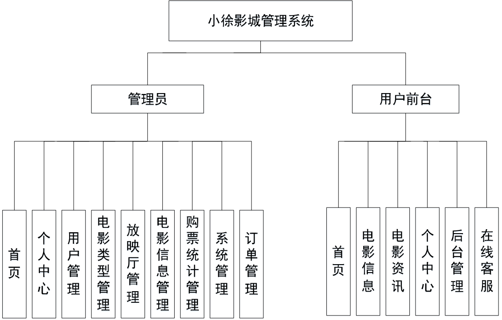

# 五、部分效果图展示

图5-1管理员登录界面图【管理员登录，通过填写用户名、密码、角色等信息，输入完成后选择登录即可进入小徐影城管理系统，如图】
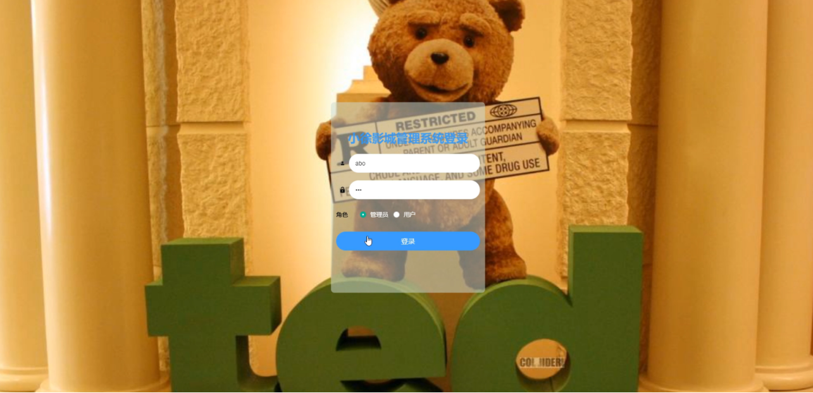

图5-2管理员功能界面图【管理员通过后台管理，进入页面可以获取首页、个人中心、用户管理、电影类型管理、放映厅管理、电影信息管理、购票统计管理、系统管理、订单管理等功能模块内容，如图】
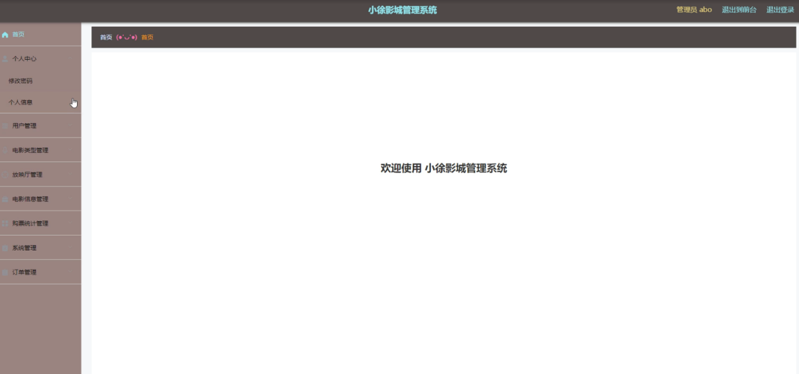

图5-3用户管理界面图【用户管理，在用户管理页面通过查看用户名、姓名、头像、性别、联系电话等信息并进行详情、删除、修改操作，如图】
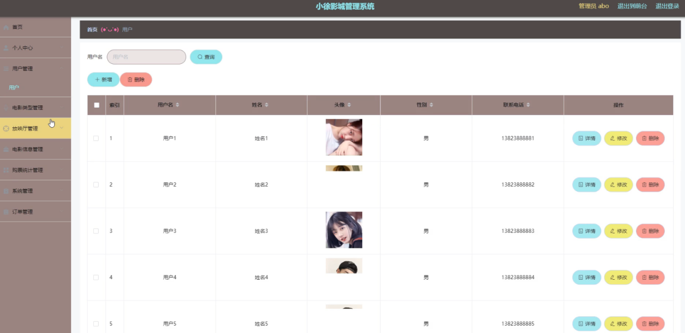

图5-4电影类型管理界面图【电影类型管理，在电影类型管理页面通过查看类型等信息进行详情、删除、修改操作。如图】
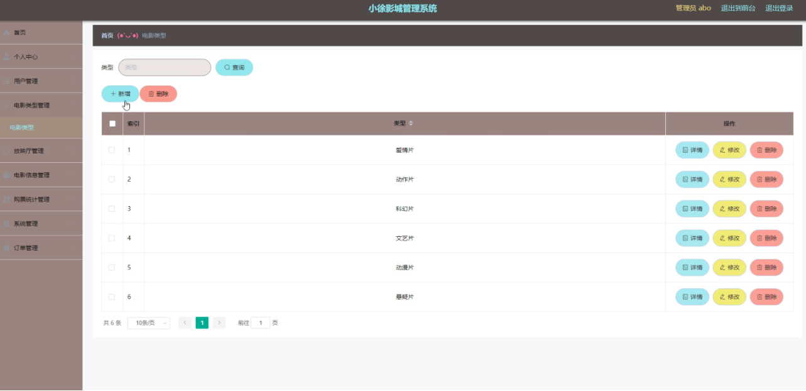

图5-5放映厅管理界面图【放映厅管理，在放映厅管理页面通过查看放映厅等信息进行详情、删除、修改操作。如图】
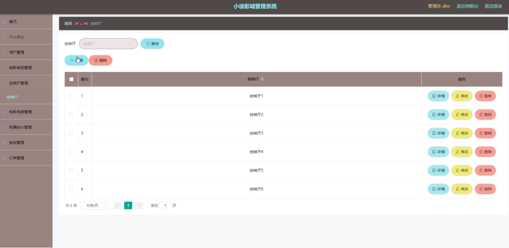

图5-6电影信息管理界面图【电影信息管理，在电影信息管理页面通过查看电影名称、类型、海报、导演、主演、上映日期、片长、电影预告、放映厅、场次、价格、座位总数、已选座位等信息进行详情、统计、查看评论、删除、修改操作。如图】
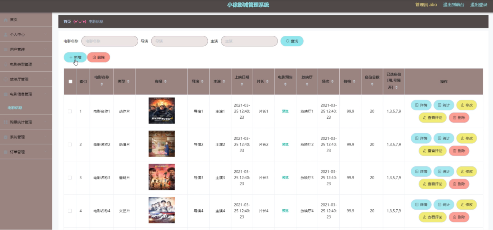

图5-7购票统计管理界面图【购票统计管理，在购票统计管理页面通过查看电影名称、类型、海报、导演、用户名、联系电话、购票数量、购票金额、购票日期、备注等信息进行详情、删除、修改操作。如图】
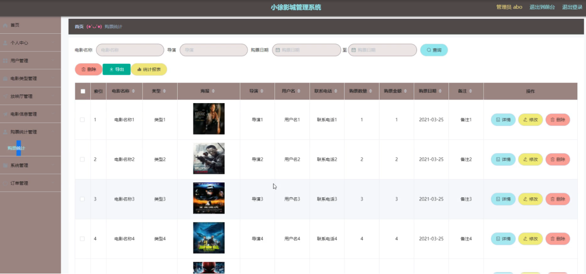

图5-8电影资讯界面图【电影资讯，在电影资讯页面通过查看标题、简介、图片等信息进行详情、删除、修改操作。如图】
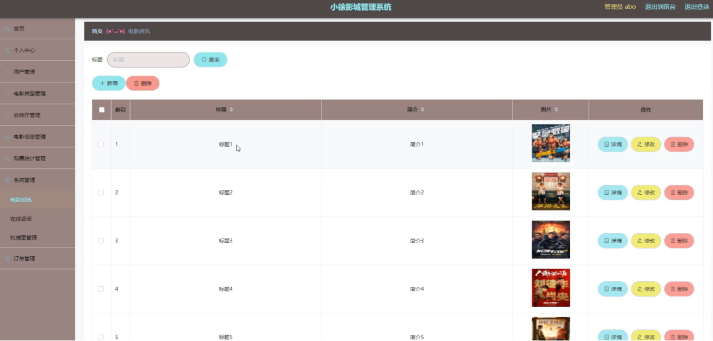

图5-9前台功能界面图【小徐影城管理系统，在前台首页可以查看首页、电影信息、电影资讯、个人中心、后台管理、在线客服等内容，如图】

图5-10电影信息界面图【电影信息，在电影信息页面中可以查看电影名称、类型、海报、导演、主演、上映日期、片长、电影预告、放映厅、场次、价格、座位总数、点击次数、已选座位等详细信息进行点我收藏、立即预定等操作，如图】
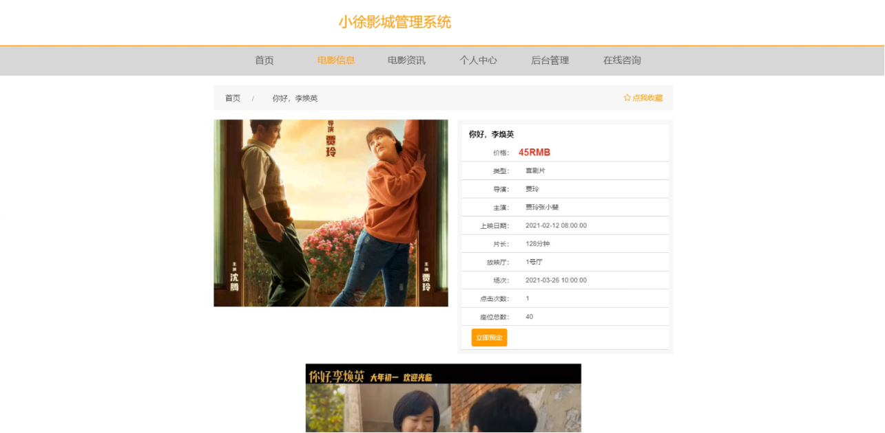

 <b>完整文章</b>
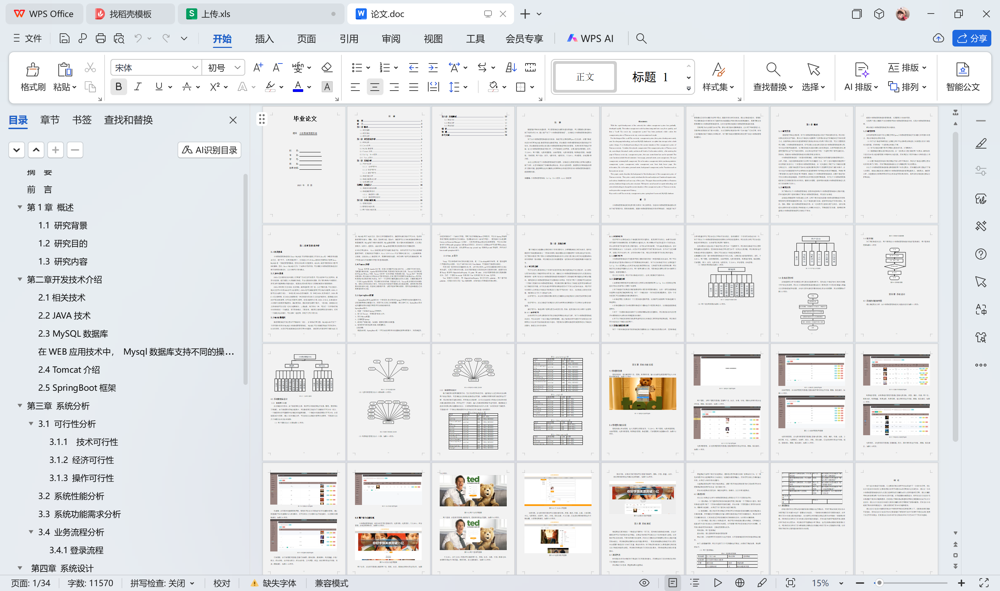

 

## 本项目获取地址：https://www.bishecode.com/product/31/

## 3000套系统可挑选，获取链接：https://www.bishecode.com/

